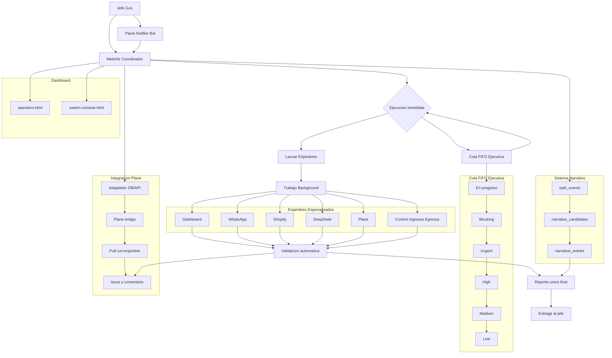

# Metiche-OS


Metiche-OS es una capa operativa sobre OpenClaw para ejecutar trabajo diario con trazabilidad real: recibe eventos (especialmente WhatsApp), decide rutas de ejecucion, coordina enjambres, sincroniza con Plane y expone un dashboard para operacion.

## Capacidades principales

- Cronista de WhatsApp: registra inbound/outbound por webhook y construye historial por cliente.
- Integracion con Plane: crea/actualiza issues desde eventos de Metiche y procesa issues etiquetados para lanzar enjambres.
- Orquestacion de enjambres: ejecuta ciclos colaborativos con agentes especializados y deja evidencia historica.
- Dashboard operativo: vista de tareas, canales, conversaciones, validadores y enlaces a issues.

## Arquitectura



### Componentes (alto nivel)

- `webhooks`: entrada de eventos (`/webhooks/openclaw/whatsapp` y `/webhooks/openclaw/whatsapp/outbound`).
- `app` (FastAPI): APIs de tareas, dashboard, memoria y swarms.
- `worker`: procesamiento de cola, narrativa y polling de Plane (`run:enjambre`).
- `dashboard`: interfaz operativa (via FastAPI o servidor Node local en `:5063`).
- `SQLite`: base de Metiche (`data/db/metiche_os.db`) con eventos, tareas, narrativa e integracion Plane.

## Requisitos previos

- Docker y Docker Compose v2.
- Python `3.11+` (si correrás scripts/smokes fuera de Docker).
- Node.js (opcional, para `dashboard/dashboard-server.mjs`).
- Acceso a OpenClaw local y, si aplica, a Plane.

Variables de entorno minimas:

```bash
METICHE_ENV=development
DATABASE_URL=sqlite:////app/data/db/metiche_os.db
OPENCLAW_GATEWAY_URL=http://host.docker.internal:18797
OPENCLAW_GATEWAY_TOKEN=
WHATSAPP_ALLOWED_NUMBERS=+5210000000000,+5210000000001

PLANE_SYNC_ENABLED=true
PLANE_USE_DIRECT_DB=true
PLANE_DB_TYPE=postgres
PLANE_PG_HOST=plane-db
PLANE_PG_PORT=5432
PLANE_PG_USER=plane
PLANE_PG_PASSWORD=plane
PLANE_PG_DBNAME=plane
PLANE_ISSUES_BASE_URL=http://plane.local/issues
```

## Instalacion y despliegue rapido

1. Clonar repositorio:

```bash
git clone https://github.com/Wikibuda/metiche-os.git
cd metiche-os
```

2. Crear `.env` (desde un template propio o manualmente) con las variables anteriores.

3. Levantar stack base:

```bash
docker compose up -d --build app worker
```

4. Verificar salud:

```bash
curl -s http://127.0.0.1:8091/health
```

5. (Opcional) Levantar stack consolidado con dashboard local:

```bash
./scripts/run-stack-consolidado.sh
```

URLs comunes:

- API docs: `http://127.0.0.1:8091/docs`
- Dashboard operativo (FastAPI): `http://127.0.0.1:8091/dashboard/operativo`
- Consola de enjambres (FastAPI): `http://127.0.0.1:8091/dashboard/swarm-console.html`
- Dashboard Node local (si corre script): `http://127.0.0.1:5063/`

## Comandos basicos de operacion

```bash
# Logs
docker compose logs -f app
docker compose logs -f worker

# Reiniciar servicios
docker compose restart app
docker compose restart worker

# Estado de contenedores
docker compose ps

# Inicializar DB (si corres en host)
python -m app.cli.main init-db

# Ejecutar worker en host
python -m app.cli.main run-worker

# Smokes clave
PYTHONPATH=. python scripts/operational_validation.py
PYTHONPATH=. python scripts/swarm_dashboard_endpoints_smoke.py
PYTHONPATH=. python scripts/channel_memory_api_smoke.py
```

## Documentacion adicional

- [Guia de Operacion Diaria](docs/OPERACION.md)
- [Guia de Despliegue en Produccion](docs/DESPLIEGUE.md)
- [Guia de Integracion con Plane](docs/INTEGRACION_PLANE.md)
- [Diagramas de Arquitectura y Flujos](docs/DIAGRAMAS.md)
- [Rollout Operativo](docs/PLAN_ROLLOUT.md)

## Estado del proyecto

- Version objetivo estable: `v1.1.0`.
- Servicios principales activos en Compose: `app`, `worker`.
- Integracion Plane soporta modo DB directa (`postgres`) y modo API.

## Licencia

MIT.
