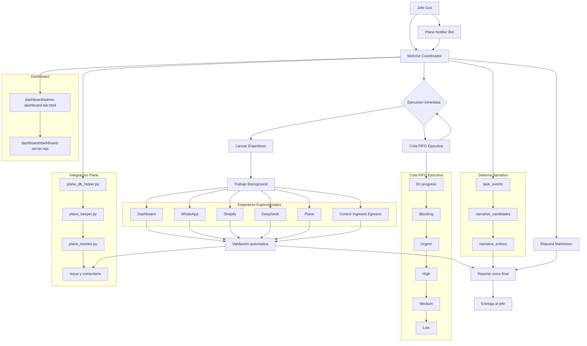

# metiche-os


Sistema operativo de coordinación para la IA personal de Gus: tareas, decisiones, validación multicanal, narrativa operativa y proyecciones vivas de bitácora.

`metiche-os` se integra con OpenClaw como capa de orquestación y memoria operacional: recibe intención del Jefe Adoptivo, decide ruta, ejecuta, valida y deja huella narrativa.

## Tabla de Contenido

- [Visión General](#visión-general)
- [Arquitectura Completa](#arquitectura-completa)
- [Características Principales](#características-principales)
- [Requisitos del Sistema](#requisitos-del-sistema)
- [Instalación y Configuración](#instalación-y-configuración)
- [Guía de Uso Rápida](#guía-de-uso-rápida)
- [Demo Visual](#demo-visual)
- [Validadores por Canal](#validadores-por-canal)
- [Narrativa y Bitácora](#narrativa-y-bitácora)
- [API HTTP](#api-http)
- [Integración con Plane](#integración-con-plane)
- [Estructura del Proyecto](#estructura-del-proyecto)
- [Contribución](#contribución)
- [FAQ](#faq)
- [Licencia](#licencia)
- [Agradecimientos e Historia](#agradecimientos-e-historia)

## Visión General

`metiche-os` existe para operar la misión completa:

- Convertir solicitudes en ejecución real con criterio (`Task -> Decision -> Execution -> Validation`).
- Reducir fricción operativa con CLI y API.
- Verificar salud por canal con validadores reales (no mocks).
- Sincronizar fallas relevantes con Plane.
- Transformar eventos operativos en narrativa útil (asombro, crónicas, colecciones, bitácora).

Relación con OpenClaw:

- OpenClaw aporta el entorno operativo y los canales.
- `metiche-os` aporta el sistema de decisión, validación, memoria narrativa y proyección.

## Arquitectura Completa

El siguiente diagrama representa la arquitectura de referencia (visión operativa + estratégica del proyecto):



### Capas arquitectónicas (estado actual)

- Operativa: flujo de tareas, decisiones, ejecución, cola y validación (`app/domain/tasks`).
- Memoria narrativa: eventos, candidatos y crónicas (`app/domain/narrative` + tablas narrativas).
- Validación multicanal real: Telegram, WhatsApp, Shopify, Dashboard, Deepseek (`app/domain/validators`).
- Proyecciones: bitácora Markdown exportable (`app/projections/bitacora.py`).
- Integración externa: Plane para registrar fallas de validación (`app/integrations/plane.py`).

### Componentes de visión (próximamente)

El diagrama incluye piezas estratégicas todavía no implementadas en este repositorio como API `/memory`, Plane-Keeper completo, y automatización total de Plane; se mantienen como hoja de ruta.

## Características Principales

- Gestión de tareas y rutas de decisión (`run`, cola, procesamiento siguiente).
- Cola de prioridad con buckets operativos (`blocking`, `urgent`, `high`, `medium`, `low`).
- Validación real por canal y validación manual por `task_id`.
- Emisión de `validation_attempt` como eventos operativos.
- Narrativa automática con nivel de asombro (3, 4, 5 según resultado).
- CLI de operación (`run`, `validate`, `narrator-tick`, `--cuentame`, `build-bitacora`).
- API HTTP para tareas, narrativa y salud.
- Sincronía con Plane ante validaciones fallidas.
- Manual completo para operación y extensión en `MANUAL_USUARIO.md`.

## Requisitos del Sistema

- Python `3.10+` (recomendado 3.11+).
- Entorno macOS/Linux (probado en macOS para este workspace).
- Dependencias Python en `requirements.txt`.
- SQLite habilitado (viene por defecto con Python).
- Variables de entorno configuradas para canales que quieras validar.

Espacio en disco:

- Depende del crecimiento de `metiche_os.db`, crónicas y proyecciones Markdown.
- Recomendación práctica: reservar espacio para crecimiento continuo de la base.

## Instalación y Configuración

### 1) Clonar y entrar al proyecto

```bash
git clone https://github.com/Wikibuda/metiche-os.git
cd metiche-os
```

### 2) Crear entorno virtual

```bash
python3 -m venv .venv
source .venv/bin/activate
```

### 3) Instalar dependencias

```bash
pip install -r requirements.txt
```

### 4) Configurar variables de entorno

Crear/editar `.env` o usar `~/.openclaw/workspace/.env` (prioridad más alta en runtime actual).

Variables clave recomendadas:

```bash
METICHE_ENV=development
DATABASE_URL=sqlite:////ruta/absoluta/metiche_os.db
PLANE_SYNC_ENABLED=true
OPENCLAW_GATEWAY_URL=http://127.0.0.1:18797

PLANE_BASE_URL=https://api.plane.so
PLANE_WORKSPACE_SLUG=<slug>
PLANE_PROJECT_ID=<id>
PLANE_API_KEY=<token>
```

### 5) Inicializar base de datos

```bash
python -m app.cli.main init-db
```

## Guía de Uso Rápida

### Ejecutar tarea

```bash
metiche run --task "validar whatsapp gateway" --task-type whatsapp --description "usando gateway unificado"
```

### Validación manual por task_id

```bash
metiche validate --task-id <task_id>
```

### Selección narrativa y promoción

```bash
metiche narrator-tick --limite 100
```

### Leer crónicas recientes

```bash
metiche --cuentame --limite 5
```

### Proyectar bitácora a Markdown

```bash
metiche build-bitacora
```

## Demo Visual

Sección pensada para material de onboarding visual en GitHub.

- Demo CLI (GIF): **próximamente**
- Demo flujo narrativo (GIF): **próximamente**
- Demo validación multicanal (GIF): **próximamente**

Mientras tanto, puedes validar el flujo completo con los comandos de la sección de uso rápido.

## Validadores por Canal

| Canal | Estado | Verificación actual | Variables clave |
|---|---|---|---|
| Telegram | Implementado | Envía mensaje con Bot API o usa fallback metadata (`user_id` + `username`) | `TELEGRAM_BOT_TOKEN`, `TELEGRAM_CHAT_ID` o `TELEGRAM_USER_ID`, `TELEGRAM_USERNAME` |
| WhatsApp | Implementado (Fase 4) | `GET /health` en gateway OpenClaw + check de canal linked/enabled en `openclaw channels list` | `OPENCLAW_GATEWAY_URL` |
| Shopify | Implementado | Ping a `shop.json` de Admin API | `SHOPIFY_STORE_DOMAIN` o `SHOPIFY_STORE_URL`, `SHOPIFY_ACCESS_TOKEN`, `SHOPIFY_API_VERSION` |
| Dashboard | Implementado | Health endpoint directo o por puerto local | `DASHBOARD_HEALTH_URL` o `DASHBOARD_PORT` |
| DeepSeek | Implementado | Validación básica de disponibilidad por credenciales/base URL | `DEEPSEEK_API_KEY`, `DEEPSEEK_BASE_URL` |

### Cómo añadir un nuevo validador

1. Crear archivo en `app/domain/validators/mi_canal_validator.py`.
2. Heredar de `BaseValidator` e implementar `validate(...)`.
3. Retornar `ValidationResult` consistente (`passed`, `detail`, `critical`, `metadata`).
4. Exportar en `app/domain/validators/__init__.py`.
5. Registrar en `_validator_registry()` en `app/domain/tasks/service.py`.
6. Mapear canal en `_resolve_required_channels(...)`.
7. Probar con `run`, `validate`, `narrator-tick`, `--cuentame`.

## Narrativa y Bitácora

Conceptos principales:

- `task_events`: eventos operativos (incluye `validation_attempt`).
- `narrative_candidates`: candidatos seleccionados por importancia/asombro.
- `narrativeentry`: crónicas publicadas.
- `narrative_collections`: agrupación diaria de crónicas.

Escala de asombro para validación:

- `5`: falla crítica.
- `4`: validación exitosa.
- `3`: informativo/no crítico.

Proyección de bitácora:

- Archivo generado en `projections/bitacora/bitacora_de_asombros.md`.

## API HTTP

### Levantar API

```bash
uvicorn app.main:app --reload --port 8000
```

### Endpoints principales

- `GET /health`
- `POST /tasks/run`
- `GET /tasks`
- `GET /tasks/{task_id}/flow`
- `POST /tasks/enqueue`
- `GET /tasks/queue`
- `POST /tasks/process-next`
- `GET /tasks/overview`
- `POST /narrative`
- `GET /narrative`

### Ejemplos curl

```bash
curl -s http://127.0.0.1:8000/health | jq
```

```bash
curl -s -X POST http://127.0.0.1:8000/tasks/run \
  -H "Content-Type: application/json" \
  -d '{
    "title": "probar validador shopify",
    "description": "prueba técnica",
    "task_type": "shopify",
    "execution_mode": "immediate"
  }' | jq
```

```bash
curl -s http://127.0.0.1:8000/tasks/<task_id>/flow | jq
```

## Integración con Plane

Cuando `PLANE_SYNC_ENABLED=true` y la validación falla:

- Se crea un issue con contexto de canales fallidos.
- Se agrega comentario al issue con resumen de la falla.

Cliente de integración:

- `app/integrations/plane.py` (`create_issue`, `update_issue`, `comment_on_issue`).

## Estructura del Proyecto

```text
metiche-os/
├─ app/
│  ├─ api/                  # Endpoints FastAPI (health, tasks, narrative, rules, soul)
│  ├─ bootstrap/            # Semillas iniciales
│  ├─ cli/                  # Comandos Typer (run, validate, narrator, bitacora)
│  ├─ core/                 # Configuración y DB engine
│  ├─ domain/
│  │  ├─ tasks/             # Modelos y flujo operativo de tareas
│  │  ├─ validators/        # Validadores reales por canal
│  │  ├─ narrative/         # Selector y servicios narrativos
│  │  └─ soul/              # Perfil/actor y piezas de contexto
│  ├─ integrations/         # Integraciones externas (Plane, readonly_openclaw)
│  ├─ projections/          # Exportadores (bitácora)
│  └─ sql/                  # DDL narrativo aditivo
├─ data/                    # SQLite y exportables
├─ dashboard/               # Dashboard web y utilidades de release lab
├─ projections/             # Salidas proyectadas
├─ MANUAL_USUARIO.md        # Manual técnico-operativo extenso
├─ MANUAL_USUARIO_FULL.html # Manual HTML completo
├─ MANUAL_USUARIO_EXEC.html # Manual HTML ejecutivo
├─ requirements.txt
└─ README.md
```

## Contribución

Guía rápida para colaborar:

1. Crear branch por feature/fix.
2. Mantener cambios aditivos y compatibles.
3. Verificar flujo CLI/API después de tocar `tasks`, `validators` o `narrative`.
4. Documentar variables nuevas en README y manual.
5. Si agregas validador, incluir prueba end-to-end mínima con `run` + `validate`.

Áreas comunes de extensión:

- Nuevos validadores por canal.
- Mejora de selección narrativa y curación de colecciones.
- Nuevas proyecciones (reportes/markdown/json).
- Mejoras de sincronía y enriquecimiento de Plane.

## FAQ

### ¿Por qué una tarea puede quedar en `failed` aunque se ejecutó?

Porque el estado final depende también de validación por canal. Si la ejecución completa pero la validación falla, la tarea cierra en `failed`.

### ¿Qué significa el asombro narrativo?

Es una señal de relevancia operacional:

- `5`: falla crítica
- `4`: éxito validado
- `3`: informativo/no crítico

### ¿Dónde está la bitácora exportada?

En `projections/bitacora/bitacora_de_asombros.md`, generada con `metiche build-bitacora`.

### ¿Cómo forzar validación manual?

Con `metiche validate --task-id <task_id>`.

### ¿El sistema ya tiene API de memoria `/memory`?

No en este repositorio actual. Aparece en la visión/roadmap del diagrama como **próximamente**.

## Licencia

Este proyecto se distribuye bajo licencia **MIT**.

Nota: si el repositorio aún no incluye `LICENSE`, agregar el archivo MIT estándar como siguiente paso de hardening legal.

## Agradecimientos e Historia

Metiche nace de una conversación operativa continua iniciada el **28 de febrero**, con una visión clara:

- Gus como **Jefe Adoptivo**.
- Metiche como coordinador técnico con criterio.
- OpenClaw como base operativa de la IA personal.
- Narrativa y bitácora como memoria viva del sistema.

Gracias a quienes colaboran manteniendo este enfoque: técnico, práctico y humano.
