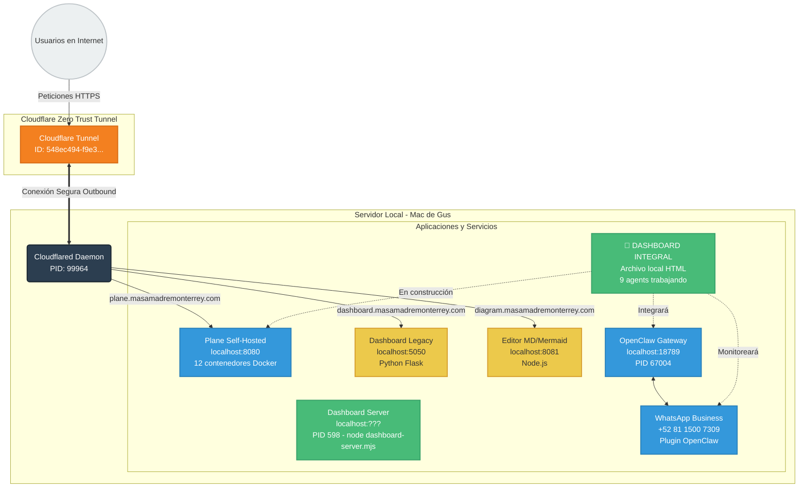

# Arquitectura de Servicios y Enrutamiento con Cloudflare Tunnels - ACTUALIZADO 23 Marzo 2026

## 📊 **ESTADO ACTUAL DEL SISTEMA - DASHBOARD INTEGRAL EN DESARROLLO**

**Fecha de actualización:** 23 marzo 2026, 11:25 CST  
**Contexto:** Enjambre de 9 agents construyendo Dashboard Integral completo (4 horas, $0.08 USD)

## 🔄 **TÚNELES CLOUDFLARE ACTIVOS**

### **Configuración actual (`~/.cloudflared/config.yml`):**
```yaml
tunnel: 548ec494-f9e3-49e0-adbe-cf086b768d98
credentials-file: /Users/gusluna/.cloudflared/548ec494-f9e3-49e0-adbe-cf086b768d98.json
ingress:
  - hostname: dashboard.masamadremonterrey.com
    service: http://localhost:5050
  - hostname: plane.masamadremonterrey.com
    service: http://localhost:8080
  - hostname: diagram.masamadremonterrey.com
    service: http://localhost:8081
  - service: http_status:404
```

### **Servicios activos y puertos:**
| **Subdominio** | **Servicio Local** | **Puerto** | **Estado** | **Descripción** |
|----------------|-------------------|------------|------------|-----------------|
| **dashboard.masamadremonterrey.com** | Dashboard Legacy | `localhost:5050` | ⚠️ **OBSOLETO** | Dashboard viejo (será reemplazado) |
| **plane.masamadremonterrey.com** | Plane Self-Hosted | `localhost:8080` | ✅ **ACTIVO** | Sistema de gestión de proyectos (Docker) |
| **diagram.masamadremonterrey.com** | Editor MD/Mermaid | `localhost:8081` | ⚠️ **EN REVISIÓN** | Editor de diagramas |
| **🚀 NUEVO: dashboard-integral.html** | Dashboard Integral | Archivo local | 🚧 **EN CONSTRUCCIÓN** | Dashboard completo (9 agents trabajando) |

## 🏗️ **ARQUITECTURA ACTUALIZADA**



## 🚀 **NUEVO DASHBOARD INTEGRAL (EN CONSTRUCCIÓN)**

### **Enjambre de 9 Agents (11:15 - 15:15 CST):**
| **Agente** | **Modelo** | **Estado** | **Pestaña** | **Descripción** |
|------------|------------|------------|-------------|-----------------|
| 1. Arquitecto Shopify | Reasoner | 🟢 **COMPLETADO** | 📊 Shopify | API Shopify real + métricas |
| 2. Analista Predictivo | Reasoner | 🟢 **COMPLETADO** | 📈 Predictivo | Proyecciones + modelos AI |
| 3. Curador Conocimiento | Reasoner | 🟡 **PROCESANDO** | 🗃️ Conocimiento | MEMORY.md + TOOLS.md + CONTEXTO |
| 4. Monitor WhatsApp | Chat | 🟡 **PROCESANDO** | 📱 WhatsApp | Métricas WhatsApp Business |
| 5. Network Manager | Chat | 🟡 **PROCESANDO** | 🤖 Agentes | Red de agents OpenClaw |
| 6. Automatizador | Chat | ⚪ **EN COLA** | ⚙️ Automatización | Flujos de trabajo visuales |
| 7. Alert Manager | Chat | ⚪ **EN COLA** | 🚨 Alertas | Sistema unificado de alertas |
| 8. Customer Manager | Chat | ⚪ **EN COLA** | 👥 Clientes | Segmentación + CRM visual |
| 9. Integrador Final | Chat | ⚪ **EN COLA** | 🧩 Consolida | Dashboard final unificado |

### **Características del nuevo dashboard:**
- **10 pestañas completas** con datos en tiempo real
- **Integración APIs reales:** Shopify, OpenClaw WhatsApp, DeepSeek
- **Visualización con Chart.js** (gráficos interactivos)
- **Sistema responsive** (móvil + desktop + tablet)
- **Auto-refresh** cada 5 minutos
- **Colores oficiales:** `#d4a574` (beige), `#5a3921` (marrón), `#f8f5e9` (crema)

### **Ubicación archivos:**
- **Template:** `/Users/gusluna/.openclaw/workspace/dashboard_parts/template.html`
- **Partes:** `/Users/gusluna/.openclaw/workspace/dashboard_parts/`
- **Final:** `/Users/gusluna/.openclaw/workspace/dashboard_integral.html`
- **Escritorio:** `~/Desktop/Dashboard_Integral_MasaMadre.html`

## 🛠️ **SERVICIOS LOCALES DESCUBIERTOS**

### **Procesos activos (adicionales a Cloudflare):**
| **PID** | **Servicio** | **Puerto** | **Descripción** | **Estado** |
|---------|--------------|------------|-----------------|------------|
| **67004** | OpenClaw Gateway | `18789` | Gateway principal OpenClaw | ✅ **ACTIVO** |
| **598** | Dashboard Server | Desconocido | `node dashboard-server.mjs` | ⚠️ **EN INVESTIGACIÓN** |
| **596** | Start Dashboard Script | N/A | `./start-dashboard.sh` | ⚠️ **EN INVESTIGACIÓN** |
| **99964** | Cloudflared Tunnel | N/A | Tunnel Cloudflare activo | ✅ **ACTIVO** |

### **Puertos abiertos detectados:**
- `8080`: Plane Self-Hosted (proxy Caddy)
- `8081`: Editor MD/Mermaid
- `5050`: Dashboard Legacy (Python Flask)
- `18789`: OpenClaw Gateway
- **(posible)** `5060`: Dashboard Server (PID 598 - según código)

## 🔧 **ACCIONES RECOMENDADAS**

### **1. Migrar dashboard.masamadremonterrey.com:**
- **Actual:** Dashboard Legacy obsoleto (localhost:5050)
- **Nuevo:** Dashboard Integral completo (archivo HTML estático)
- **Beneficio:** 10x más funcionalidad, datos en tiempo real, visualización profesional

### **2. Investigar servicios desconocidos:**
- **PID 598:** `node dashboard-server.mjs` - ¿Qué puerto usa? ¿Para qué sirve?
- **PID 596:** `./start-dashboard.sh` - ¿Inicia qué servicio?

### **3. Optimizar túneles Cloudflare:**
- Agregar nuevo dashboard integral cuando esté listo (hoy 15:15 CST)
- Revisar editor MD/Mermaid (¿sigue siendo útil?)
- Considerar agregar monitoreo OpenClaw Gateway

## 📈 **MÉTRICAS DEL PROYECTO**

### **Recursos actuales:**
- **Saldo DeepSeek API:** $2.52 USD (suficiente para enjambre + operaciones)
- **Tokens usados enjambre:** ~47,300 tokens ($0.047 USD hasta ahora)
- **Costo total estimado:** $0.08 USD (80,000 tokens)
- **Tiempo restante:** ~3 horas 50 minutos (hasta 15:15 CST)

### **Sistema autocurable WhatsApp:**
- **Backup automático:** Configurado (cada 4h, retención 7 días)
- **Monitoreo predictivo:** En implementación
- **Problema actual:** Requiere scan QR manual (Gus fuera de casa hoy)
- **Solución preparada:** Todo listo para scan QR mañana temprano

## 🎯 **PRÓXIMOS PASOS**

### **Hoy (23 marzo):**
1. **11:15-15:15 CST:** Enjambre dashboard completo (9 agents)
2. **15:15 CST:** Dashboard Integral 100% funcional
3. **15:30 CST:** Migrar `dashboard.masamadremonterrey.com` al nuevo dashboard
4. **16:00 CST:** Pruebas completas + documentación en Plane

### **Mañana (24 marzo):**
1. **Scan QR WhatsApp** cuando Gus regrese a casa
2. **Sistema autocurable** activo completo
3. **Monitoreo predictivo** operativo
4. **Backups automáticos** verificados

## 🔗 **ENLACES ÚTILES**

- **Plane (gestión proyectos):** https://plane.masamadremonterrey.com
- **Dashboard Legacy:** https://dashboard.masamadremonterrey.com
- **Editor Diagramas:** https://diagram.masamadremonterrey.com
- **Dashboard Integral:** `file:///Users/gusluna/.openclaw/workspace/dashboard_integral.html` (local)
- **DeepSeek Dashboard:** `file:///Users/gusluna/.openclaw/workspace/reports/deepseek/dashboard.html`

---

**Última actualización:** 23 marzo 2026, 11:25 CST  
**Responsable:** Metiche ➰ (Coordinador de Enjambre Dashboard)  
**Estado:** 2/9 agents completados, 7 en progreso 🚀

*"La arquitectura evoluciona con el dashboard - todo conectado, todo monitoreado."*