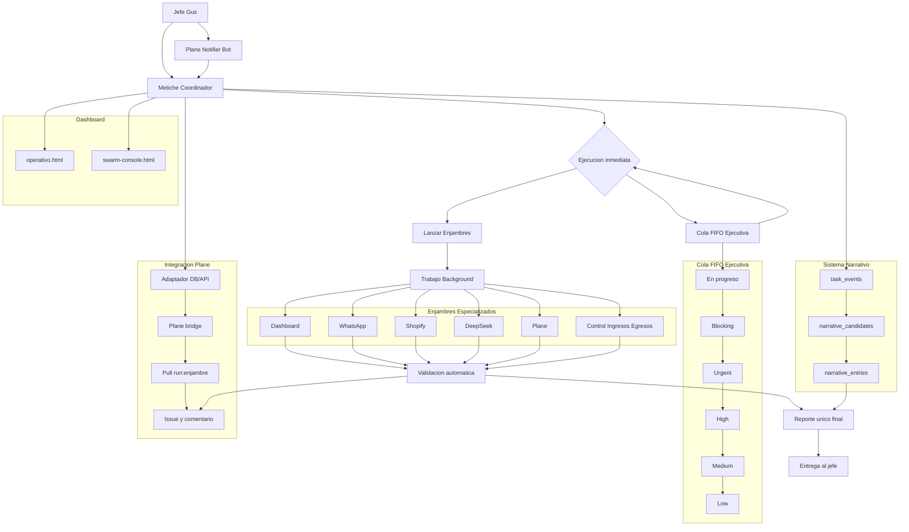
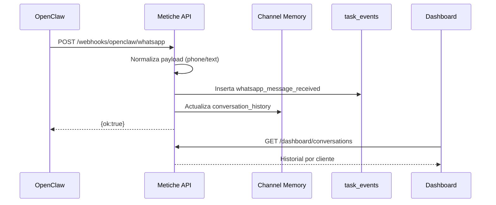
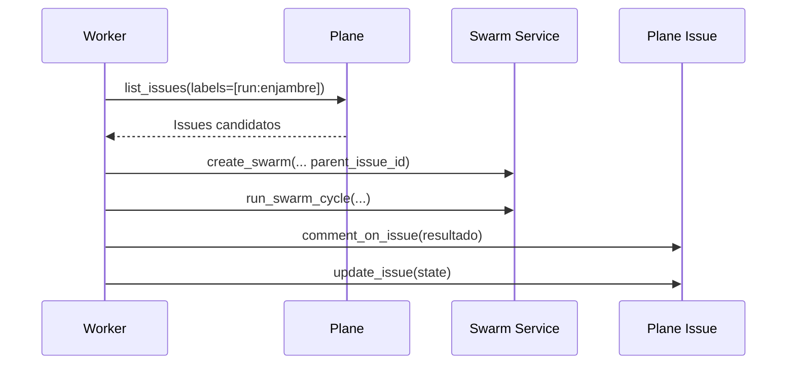
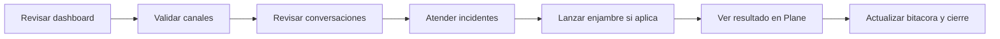

# Diagramas de Metiche-OS

Este documento centraliza diagramas de arquitectura y flujo operativo.

## 1) Arquitectura general

## 2) Flujo webhook de WhatsApp

## 3) Flujo Plane -> Enjambre

## 4) Flujo de operacion diaria recomendado

## 5) Referencias cruzadas

- [README](../README.md)
- [Operacion diaria](OPERACION.md)
- [Despliegue](DESPLIEGUE.md)
- [Integracion Plane](INTEGRACION_PLANE.md)
