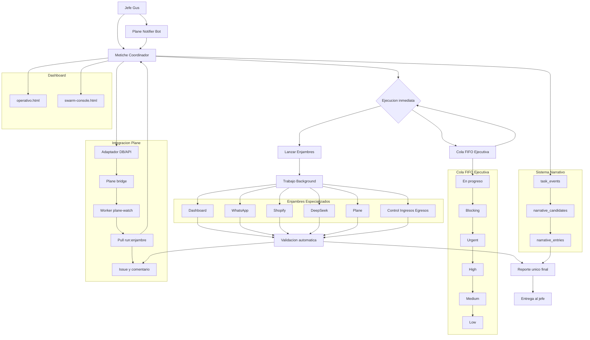
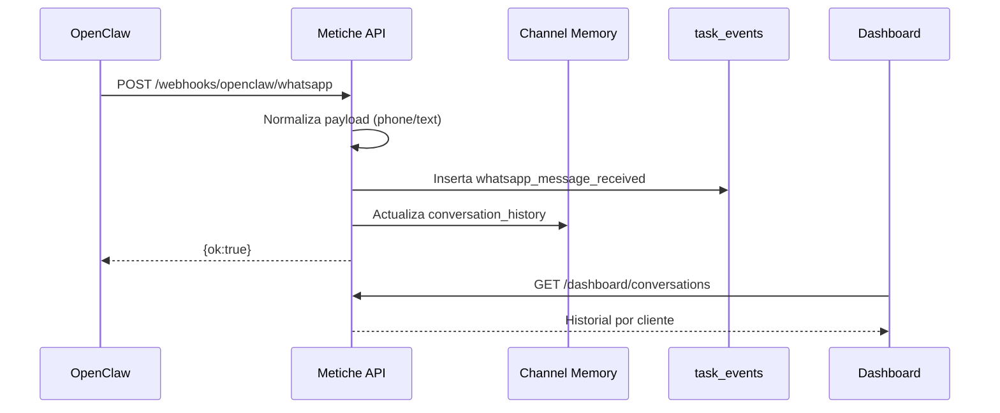
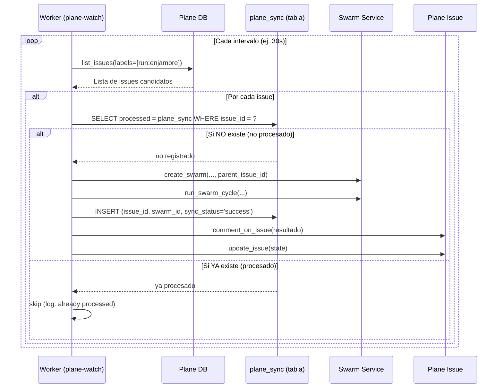
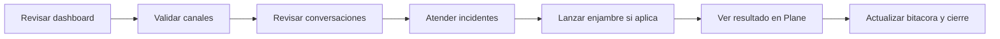

# Diagramas de Metiche-OS

Este documento centraliza diagramas de arquitectura y flujo operativo.

## 1) Arquitectura general

La arquitectura de Metiche-OS se organiza en torno a un coordinador central (Metiche) que recibe ordenes del Jefe (Gus) o de Plane (a traves del notificador). Las tareas pueden ejecutarse de forma inmediata (lanzando enjambres) o encolarse en una cola FIFO con prioridades (blocking, urgent, high, medium, low).

Los enjambres ejecutan trabajo en background a traves de agentes especializados (Dashboard, WhatsApp, Shopify, DeepSeek, Plane, Control de Ingresos/Egresos). Una validacion automatica consolida los resultados en un reporte unico que se entrega al Jefe.

El sistema narrativo registra cada evento (`task_events`), los promueve a candidatos (`narrative_candidates`) y los convierte en cronicas (`narrative_entries`) que alimentan la bitacora de asombros.

La integracion con Plane es bidireccional:

- Metiche -> Plane: a traves del adaptador DB/API, puede crear y actualizar issues (por ejemplo, cuando una tarea falla).
- Plane -> Metiche: el worker `plane-watch` detecta issues con etiqueta `run:enjambre` y lanza enjambres en Metiche (flecha `P4 --> B`).

El dashboard ofrece dos vistas principales: `operativo.html` (monitoreo general) y `swarm-console.html` (control de enjambres).

## 2) Flujo webhook de WhatsApp

Cuando un cliente envia un mensaje a traves de WhatsApp Business, OpenClaw lo reenvia al webhook de Metiche (`POST /webhooks/openclaw/whatsapp`). La API normaliza el payload extrayendo el numero de telefono (`from`) y el texto (`content`). A continuacion, registra el evento `whatsapp_message_received` en `task_events` (para trazabilidad) y actualiza el historial de la conversacion en `channel_memory` (clave por numero de telefono). El webhook responde con `{ok:true}` para que OpenClaw no reintente.

El dashboard, al consultar `GET /dashboard/conversations`, recupera el historial completo agrupado por cliente, mostrando los mensajes en orden cronologico. Este flujo convierte a Metiche en un "cronista silencioso" de las conversaciones reales, sin interferir en la operacion del bot "Masa Madre".

## 3) Flujo Plane -> Enjambre

El worker `plane-watch` consulta periodicamente (por defecto cada 30 segundos) los issues de Plane que tienen la etiqueta `run:enjambre`. Para cada issue candidato, verifica en la tabla `plane_sync` si ya ha sido procesado.

Si no existe un registro, crea un enjambre vinculado al issue (`parent_issue_id`), ejecuta su ciclo, y registra la operacion en `plane_sync` (guardando el `issue_id` y el `swarm_id`). A continuacion, anade un comentario en el issue de Plane con el resultado y actualiza su estado (por ejemplo, a In Progress o Done).

Si el issue ya existe en `plane_sync`, el worker lo omite (log como "already processed"). Esto garantiza idempotencia: un mismo issue no lanza multiples enjambres, incluso si el worker se reinicia o si el issue se actualiza por otros motivos (como anadir un comentario).

## 4) Flujo de operacion diaria recomendado

## 5) Referencias cruzadas

- [README](../README.md)
- [Operacion diaria](OPERACION.md)
- [Despliegue](DESPLIEGUE.md)
- [Integracion Plane](INTEGRACION_PLANE.md)
