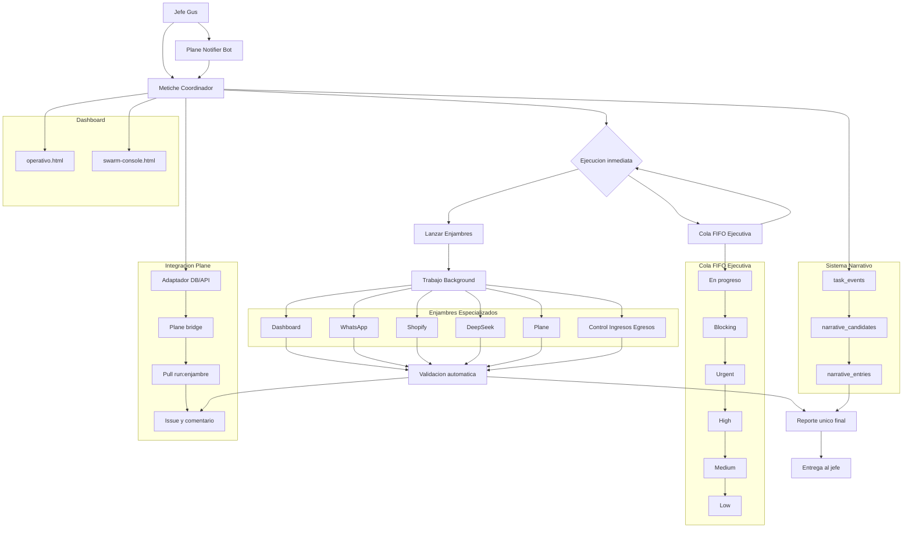
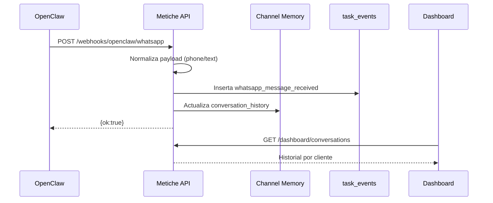
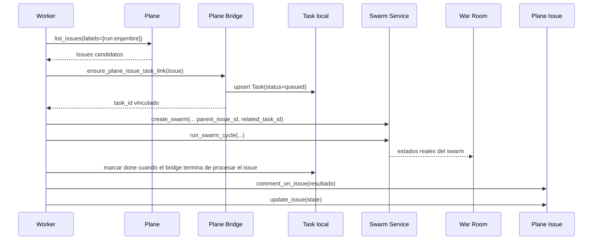
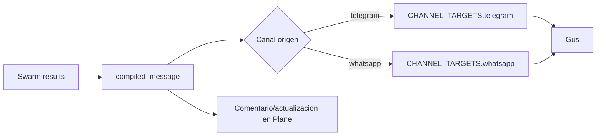
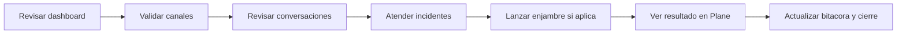

# Diagramas de Metiche-OS

Este documento centraliza diagramas de arquitectura y flujo operativo.

## 1) Arquitectura general

```mermaid
graph TD
  A[Jefe Gus] --> B[Metiche Coordinador]
  A --> C[Plane Notifier Bot]
  C --> B

  B --> D{Ejecucion inmediata}
  D --> E[Lanzar Enjambres]
  D --> F[Cola FIFO Ejecutiva]
  F --> D

  subgraph COLA[Cola FIFO Ejecutiva]
    direction TB
    F1[En progreso]
    F2[Blocking]
    F3[Urgent]
    F4[High]
    F5[Medium]
    F6[Low]
    F1 --> F2 --> F3 --> F4 --> F5 --> F6
  end

  F --> F1
  E --> G[Trabajo Background]

  subgraph ENJAMBRES[Enjambres Especializados]
    direction LR
    G1[Dashboard]
    G2[WhatsApp]
    G3[Shopify]
    G4[DeepSeek]
    G5[Plane]
    G6[Control Ingresos Egresos]
  end

  G --> G1
  G --> G2
  G --> G3
  G --> G4
  G --> G5
  G --> G6

  G1 --> H[Validacion automatica]
  G2 --> H
  G3 --> H
  G4 --> H
  G5 --> H
  G6 --> H

  H --> I[Reporte unico final]
  I --> J[Entrega al jefe]

  subgraph NARRATIVA[Sistema Narrativo]
    direction TB
    N1[task_events]
    N2[narrative_candidates]
    N3[narrative_entries]
  end

  B --> N1
  N1 --> N2 --> N3
  N3 --> I

  subgraph PLANE[Integracion Plane]
    direction TB
    P1[Adaptador DB/API]
    P2[Plane bridge]
    P3[Pull run:enjambre]
    P4[Issue y comentario]
  end

  B --> P1
  P1 --> P2 --> P3 --> P4
  H --> P4

  subgraph DASHBOARD[Dashboard]
    direction TB
    D1[operativo.html]
    D2[swarm-console.html]
  end

  B --> D1
  B --> D2
```

## 2) Flujo webhook de WhatsApp

```mermaid
sequenceDiagram
  participant OC as OpenClaw
  participant API as Metiche API
  participant MEM as Channel Memory
  participant EV as task_events
  participant DB as Dashboard

  OC->>API: POST /webhooks/openclaw/whatsapp
  API->>API: Normaliza payload (phone/text)
  API->>EV: Inserta whatsapp_message_received
  API->>MEM: Actualiza conversation_history
  API-->>OC: {ok:true}
  DB->>API: GET /dashboard/conversations
  API-->>DB: Historial por cliente
```

## 3) Flujo Plane -> Enjambre

```mermaid
sequenceDiagram
  participant W as Worker
  participant PL as Plane
  participant BR as Plane Bridge
  participant TK as Task local
  participant SW as Swarm Service
  participant WR as War Room
  participant PI as Plane Issue

  W->>PL: list_issues(labels=[run:enjambre])
  PL-->>W: Issues candidatos
  W->>BR: ensure_plane_issue_task_link(issue)
  BR->>TK: upsert Task(status=queued)
  BR-->>W: task_id vinculado
  W->>SW: create_swarm(... parent_issue_id, related_task_id)
  W->>SW: run_swarm_cycle(...)
  SW-->>WR: estados reales del swarm
  W->>TK: marcar done cuando el bridge termina de procesar el issue
  W->>PI: comment_on_issue(resultado)
  W->>PI: update_issue(state)
```

## 4) Modelo canonico Plane <-> War Room

| Componente | Rol canonico | Estados principales | Que significa |
| --- | --- | --- | --- |
| Issue de Plane | Define que hay que hacer | estados de Plane | Pedido y seguimiento del trabajo |
| Task local | Semaforo del bridge | `queued`, `done` | El bridge ya recibio y proceso el issue |
| Swarm | Ejecucion real | `pending`, `running`, `completed`, `failed` | Trabajo operativo del enjambre |
| War Room | Vista de observabilidad | muestra Task y Swarm por separado | Evita confundir recepcion con ejecucion |

Regla institucional:

- `Task.status=queued/done` no describe avance operativo; solo confirma que el bridge ya consumio el issue de Plane.
- `Swarm.status=pending/running/completed/failed` es la fuente de verdad para el progreso real del trabajo.
- El War Room debe poder mostrar ambos planos sin mezclar el trigger de integracion con la ejecucion.
- El comentario de vuelta a Plane y la notificacion al jefe deben salir del resultado del swarm, no del status de la task local.

## 5) Retorno de resultados y routing de canales

```mermaid
flowchart LR
  A[Swarm results] --> B[compiled_message]
  B --> C{Canal origen}
  C -->|telegram| D[CHANNEL_TARGETS.telegram]
  C -->|whatsapp| E[CHANNEL_TARGETS.whatsapp]
  D --> F[Gus]
  E --> F[Gus]
  B --> G[Comentario/actualizacion en Plane]
```

Decision de arquitectura:

- `compiled_message` es la respuesta consolidada del enjambre.
- `CHANNEL_TARGETS` es una decision explicita de routing estable y no un workaround temporal.
- El destino final puede diferir del `client_key` de origen cuando la arquitectura requiere consolidar la respuesta en el canal del jefe.

## 6) Flujo de operacion diaria recomendado

```mermaid
flowchart LR
  A[Revisar dashboard] --> B[Validar canales]
  B --> C[Revisar conversaciones]
  C --> D[Atender incidentes]
  D --> E[Lanzar enjambre si aplica]
  E --> F[Ver resultado en Plane]
  F --> G[Actualizar bitacora y cierre]
```

## 7) Referencias cruzadas

- [README](../README.md)
- [Operacion diaria](OPERACION.md)
- [Despliegue](DESPLIEGUE.md)
- [Integracion Plane](INTEGRACION_PLANE.md)
