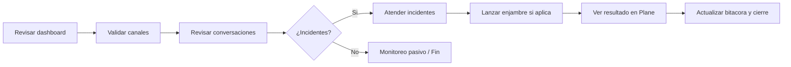

# Guia de Operacion Diaria

Esta guia cubre la rutina diaria de Metiche-OS para operar sin entrar al codigo.

## 1) Acceso al dashboard

Rutas disponibles:

- Operativo (FastAPI): `http://127.0.0.1:8091/dashboard/operativo`
- Consola de enjambres (FastAPI): `http://127.0.0.1:8091/dashboard/swarm-console.html`
- Operativo (Node local): `http://127.0.0.1:5063/`
- Consola (Node local): `http://127.0.0.1:5063/swarm-console.html`

Credenciales:

- Por defecto no hay login en el dashboard local.
- Si expones fuera de red interna, protege con proxy (Nginx/Caddy + auth).

Lectura rapida de secciones:

- Conversaciones: historial por cliente WhatsApp, ultimo mensaje y direccion inbound/outbound.
- Estado de canales: salud y actividad reciente por WhatsApp/Telegram.
- Enjambres: ciclos ejecutados, decision (`accept/reject`), objetivo y trazabilidad.

## 2) Flujo de operacion diaria con decision



La operacion diaria de Metiche-OS sigue un flujo simple pero efectivo:

- Revisar el dashboard (`operativo.html` o `swarm-console.html`) para obtener una vision general del estado del sistema.
- Validar los canales (WhatsApp, Plane, etc.) confirmando que estan verdes (operativos) y que no hay alertas criticas.
- Revisar las conversaciones recientes (seccion "Conversaciones WhatsApp") para identificar consultas de clientes, incidentes o posibles fallos del bot "Masa Madre".
- ¿Incidentes? Si no hay, el operador puede pasar a monitoreo pasivo. Si los hay, continuar al paso siguiente.
- Atender incidentes (por ejemplo, responder al cliente, investigar errores en los logs, o escalar el problema).
- Lanzar un enjambre si la solucion puede automatizarse (crear un issue en Plane con la etiqueta `run:enjambre`). El enjambre se ejecutara y actualizara el issue automaticamente.
- Ver el resultado en Plane (comentarios, cambios de estado) para confirmar que el enjambre completo su tarea.
- Actualizar la bitacora (con `metiche --momento`) y cerrar el incidente, dejando trazabilidad para futuras referencias.

Este flujo garantiza que ninguna incidencia quede sin seguimiento y que el sistema aprenda de cada evento, alimentando la mejora continua.

## 3) Monitoreo de conversaciones

### Buscar por cliente

Usa el endpoint del dashboard:

```bash
curl -s "http://127.0.0.1:8091/dashboard/conversations?q=+5215512345678&limit_clients=5&limit_messages=40" | jq
```

Tambien puedes buscar por texto (`q=palabra-clave`) para encontrar conversaciones relacionadas.

### Ver historial completo

Metiche guarda conversacion en memoria de canal (`conversation_history`) y la expone en:

```bash
curl -s "http://127.0.0.1:8091/channel-memory/+5215512345678?channel=whatsapp" | jq
```

### Entender eventos

Eventos frecuentes:

- `whatsapp_message_received`: mensaje entrante recibido por webhook.
- `whatsapp_message_sent`: salida registrada por webhook outbound.
- `validation_attempt`: resultado de validacion de tarea/canal.

## 4) Gestion de enjambres

### Lanzar enjambre manual

1. Crear swarm:

```bash
curl -s -X POST http://127.0.0.1:8091/swarm \
  -H "Content-Type: application/json" \
  -d '{
    "name": "Swarm Operativo",
    "goal": "Resolver incidente WhatsApp",
    "policy": "narrative-consensus",
    "agents": ["whatsapp", "telegram", "deepseek", "plane"]
  }' | jq
```

2. Ejecutar ciclo:

```bash
curl -s -X POST http://127.0.0.1:8091/swarm/<swarm_id>/run \
  -H "Content-Type: application/json" \
  -d '{
    "objective": "Diagnosticar y resolver webhook",
    "client_key": "warroom:manual",
    "max_cycles": 1
  }' | jq
```

### Ver estado e historial

```bash
curl -s http://127.0.0.1:8091/swarm | jq
curl -s http://127.0.0.1:8091/swarm/<swarm_id>/history | jq
```

## 5) Integracion con Plane (operacion)

### Issue que lanza enjambre (`run:enjambre`)

Para que el worker lo procese automaticamente, el issue debe tener etiqueta `run:enjambre`.

Recomendado:

- Etiqueta de control: `run:enjambre`.
- Etiqueta de clasificacion (opcional): `metiche:task`.

Cuando el worker detecta el issue:

- Crea un swarm con `parent_issue_id`.
- Ejecuta 1 ciclo.
- Comenta el resultado en Plane y actualiza estado.

### Ver issues vinculados desde dashboard

```bash
curl -s "http://127.0.0.1:8091/dashboard/plane/issues?limit=30" | jq
```

## 6) Resolucion de problemas comunes

### Caso A: el webhook no recibe mensajes

Checklist:

- Verifica endpoint en OpenClaw: `POST /webhooks/openclaw/whatsapp`.
- Revisa que llegue `phone_number` y `text` (si faltan, responde `missing_phone_or_text`).
- Revisa logs del servicio `app`.

Comando:

```bash
docker compose logs --tail=200 -f app
```

### Caso B: dashboard sin eventos

Checklist:

- Confirma salud API: `GET /health`.
- Revisa que existan filas en `task_events`.
- Ejecuta smoke del dashboard.

Comandos:

```bash
curl -s http://127.0.0.1:8091/health
PYTHONPATH=. python scripts/channels_dashboard_smoke.py
```

### Caso C: logs crecen demasiado rapido

Acciones:

- Limitar seguimiento continuo (`logs -f`) solo durante incidentes.
- Rotar/truncar logs locales del dashboard (`data/dashboard-5063.log`).
- Ajustar verbosidad y frecuencia de polling si aplica.

## 7) Comandos utiles de operacion

```bash
# Estado general
docker compose ps

# Levantar/actualizar servicios
docker compose up -d --build app worker

# Reinicio rapido
docker compose restart app worker

# Logs por servicio
docker compose logs -f app
docker compose logs -f worker

# Ejecutar comando dentro de app
docker compose exec app python -m app.cli.main init-db

# Smokes operativos
PYTHONPATH=. python scripts/operational_validation.py
PYTHONPATH=. python scripts/swarm_integration_smoke.py
PYTHONPATH=. python scripts/whatsapp_adapter_smoke.py
```

## 8) Referencias cruzadas

- [README](../README.md)
- [Despliegue](DESPLIEGUE.md)
- [Integracion con Plane](INTEGRACION_PLANE.md)
- [Diagramas](DIAGRAMAS.md)
